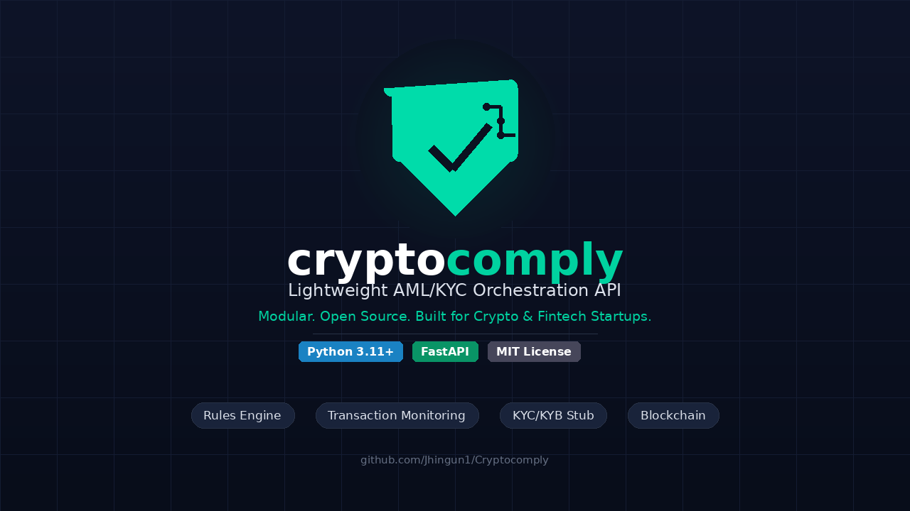
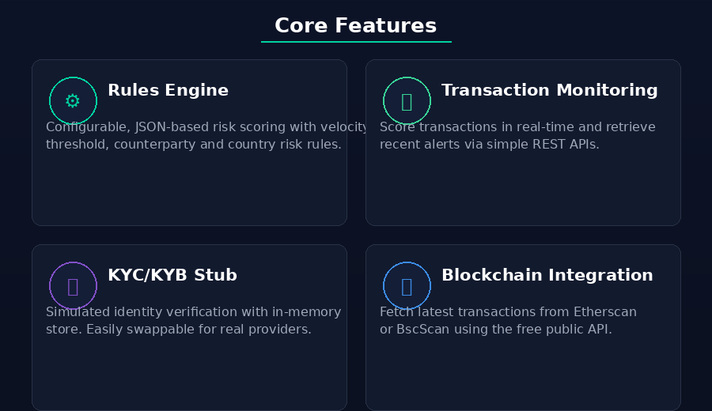
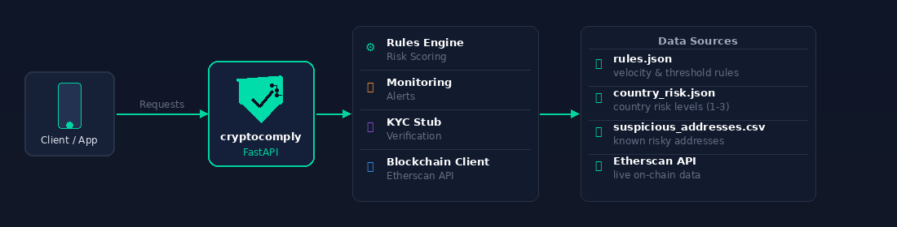
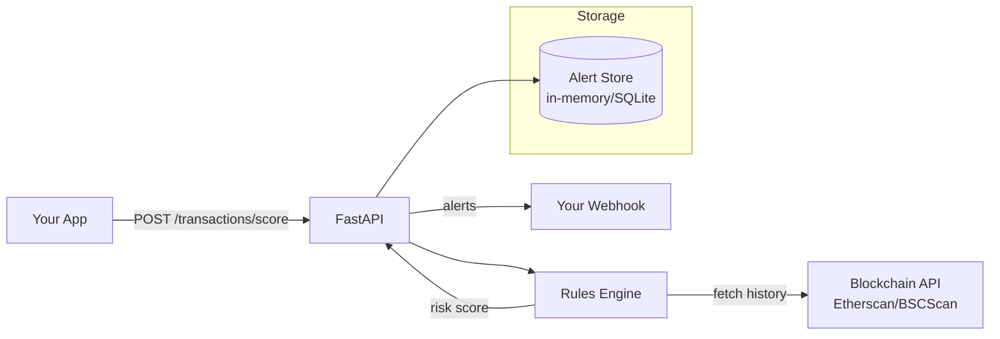
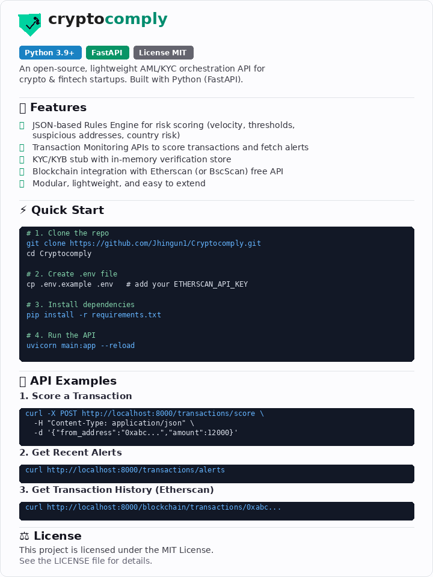

<div align="center">
  
</div>

<div align="center">

[](LICENSE)
[](https://www.python.org/)
[](https://fastapi.tiangolo.com/)
[](https://opensource.org/)
[](CONTRIBUTING.md)
[](https://github.com/Jhingun1/Cryptocomply/commits)
[](https://github.com/Jhingun1/Cryptocomply/stargazers)

</div>

A lightweight, open-source **AML/KYC orchestration API** built with FastAPI,
targeting small crypto and fintech startups (stablecoin apps, DeFi dashboards, payment processors).

---

## 📖 Table of Contents

1. [✨ Features](#-features)
2. [🎯 Who is this for?](#-who-is-this-for)
3. [🧠 Architecture](#-architecture)
4. [🚀 Quick Start](#-quick-start)
5. [📡 API Reference](#-api-reference)
6. [📋 API Examples](#-api-examples)
7. [⚙️ Configuration](#️-configuration)
8. [🔌 Integrations](#-integrations)
9. [🔧 Extending Custom Rules](#-extending-custom-rules)
10. [⛓️ Blockchain Integration](#️-blockchain-integration)
11. [🧪 Testing](#-testing)
12. [🗺️ Roadmap](#️-roadmap)
13. [🤝 Contributing](#-contributing)
14. [📄 License](#-license)
15. [💖 Support](#-support)

---

## ✨ Features

<div align="center">
  
</div>
<br/>

- ✅ **JSON-based risk rules** – velocity checks, thresholds, country risk, address blacklists
- ✅ **Modular rules engine** – add custom rules without changing core code
- ✅ **Free blockchain clients** – Etherscan & BSCScan (plug-in architecture for others)
- ✅ **KYC/KYB stub** – drop-in replacement for real providers (Sumsub, Persona)
- ✅ **Webhook alerts** – real-time notifications for flagged transactions
- ✅ **Docker support** – one-command deploy
- ✅ **Open source (MIT)** – auditable, extensible, no vendor lock-in

| Module | Description |
|--------|-------------|
| **Rules Engine** | JSON-configurable risk scoring: velocity checks, amount thresholds, suspicious-address blocklist, country risk |
| **Transaction Monitoring** | `POST /transactions/score` scores any transaction 0–100 and returns triggered alerts |
| **Alerts Feed** | `GET /transactions/alerts` returns recent flagged transactions |
| **KYC/KYB Stub** | In-memory identity verification simulation; swappable for a real provider |
| **Blockchain Client** | Fetches transaction history from Etherscan or BSCScan (free API tier) |

---

## 🎯 Who is this for?

| User | Why they need CryptoComply |
|------|---------------------------|
| Stablecoin payment startups | USDT/USDC cross-border transfers – affordable monitoring |
| Small remittance corridors | Velocity & country risk checks without a compliance team |
| Local crypto on/off-ramps | AUSTRAC-ready transaction monitoring |
| DeFi front-ends | Block known mixer addresses & high-risk wallets |
| Open-source crypto projects | Show regulators a transparent AML baseline |

---

## 🧠 Architecture

<div align="center">
  
</div>



---

## 🚀 Quick Start

### With Docker (recommended)

```bash
docker run -p 8000:8000 \
  -e ETHERSCAN_API_KEY=your_etherscan_key \
  ghcr.io/jhingun1/cryptocomply:latest
```

### Local installation

```bash
git clone https://github.com/Jhingun1/Cryptocomply.git
cd Cryptocomply
python -m venv venv
source venv/bin/activate   # or `venv\Scripts\activate` on Windows
pip install -r requirements.txt
cp .env.example .env
# Edit .env with your ETHERSCAN_API_KEY
uvicorn main:app --reload
```

The API will be available at **http://localhost:8000**.  
Interactive docs: **http://localhost:8000/docs** (Swagger UI) or **http://localhost:8000/redoc**

---

## 📡 API Reference

### Transaction Monitoring

| Method | Path | Description |
|--------|------|-------------|
| `POST` | `/transactions/score` | Score a transaction (0–100) and list triggered rules |
| `GET` | `/transactions/alerts` | Get recent flagged transactions |
| `DELETE` | `/transactions/alerts` | Clear all alerts (dev/test use) |

### KYC / KYB

| Method | Path | Description |
|--------|------|-------------|
| `GET` | `/kyc/status/{user_id}` | Get verification status for a user |
| `POST` | `/kyc/submit/{user_id}` | Submit identity documents |
| `PATCH` | `/kyc/status/{user_id}` | Manually update status (admin) |
| `GET` | `/kyc/users` | List all KYC records (admin) |

### Blockchain

| Method | Path | Description |
|--------|------|-------------|
| `GET` | `/blockchain/transactions/{address}` | Last N normal transactions (Etherscan) |
| `GET` | `/blockchain/token-transfers/{address}` | Last N ERC-20 token transfers |

### Health

| Method | Path |
|--------|------|
| `GET` | `/` |
| `GET` | `/health` |

<div align="center">
  
</div>

---

## 📋 API Examples

### Score a transaction (curl)

```bash
curl -X POST http://localhost:8000/transactions/score \
  -H "Content-Type: application/json" \
  -d '{
    "from_address": "0x1da5821544e25c636c1417ba96ade4cf6d2f9b5a",
    "to_address": "0xabcdef1234567890abcdef1234567890abcdef12",
    "amount": 75000,
    "currency": "USDC",
    "timestamp": "2024-01-15T12:00:00Z",
    "country_code": "KP"
  }'
```

**Response:**

```json
{
  "transaction_id": "c8f3a1b2-...",
  "risk_score": 100,
  "risk_level": "CRITICAL",
  "flagged": true,
  "triggered_rules": [
    {
      "rule_id": "suspicious_counterparty",
      "rule_name": "Suspicious Counterparty",
      "alert_level": "CRITICAL",
      "risk_score": 80,
      "message": "Address 0x1da58... is on the suspicious counterparty blocklist",
      "details": { "flagged_address": "0x1da5...", "field": "from_address" }
    },
    {
      "rule_id": "single_large_tx",
      "rule_name": "Single Large Transaction",
      "alert_level": "MEDIUM",
      "risk_score": 30,
      "message": "Single transaction amount 75000.0 exceeds threshold of 50000",
      "details": { "amount": 75000.0, "threshold": 50000 }
    }
  ],
  "scored_at": "2024-01-15T12:00:01Z",
  "from_address": "0x1da5821544e25c636c1417ba96ade4cf6d2f9b5a",
  "to_address": "0xabcdef...",
  "amount": 75000.0,
  "currency": "USDC",
  "timestamp": "2024-01-15T12:00:00Z"
}
```

### Score a transaction (Python)

```python
import requests, datetime

resp = requests.post("http://localhost:8000/transactions/score", json={
    "from_address": "0xabc123",
    "to_address": "0xdef456",
    "amount": 500,
    "currency": "ETH",
    "timestamp": datetime.datetime.utcnow().isoformat() + "Z",
})
print(resp.json())
```

### Get flagged transactions

```bash
# All alerts
curl http://localhost:8000/transactions/alerts

# Filter by alert level and sender
curl "http://localhost:8000/transactions/alerts?alert_level=CRITICAL&limit=20"
```

### KYC – submit identity documents

```bash
# Check status (creates PENDING record on first call)
curl http://localhost:8000/kyc/status/user_42

# Submit documents
curl -X POST http://localhost:8000/kyc/submit/user_42 \
  -H "Content-Type: application/json" \
  -d '{"document_type": "passport", "full_name": "Alice Smith", "nationality": "US"}'

# Force review outcome (stub only)
curl -X POST http://localhost:8000/kyc/submit/user_42 \
  -H "Content-Type: application/json" \
  -d '{"document_type": "passport", "review": true}'
```

### Blockchain – fetch transaction history

```bash
# Last 10 ETH transactions
curl "http://localhost:8000/blockchain/transactions/0xde0B295669a9FD93d5F28D9Ec85E40f4cb697BAe?limit=10&chain=ethereum"

# ERC-20 token transfers on BSC
curl "http://localhost:8000/blockchain/token-transfers/0xde0B295669a9FD93d5F28D9Ec85E40f4cb697BAe?chain=bsc"
```

---

## ⚙️ Configuration

Environment variables (`.env` file or system environment):

| Variable | Default | Description |
|----------|---------|-------------|
| `ETHERSCAN_API_KEY` | *(none)* | Required for Ethereum history |
| `BSCSCAN_API_KEY` | *(none)* | Required for BSC history |
| `DEFAULT_CHAIN` | `ethereum` | Default chain for blockchain lookups (`ethereum` \| `bsc`) |
| `HOST` | `0.0.0.0` | Server bind host |
| `PORT` | `8000` | Server bind port |
| `CORS_ORIGINS` | `*` | Comma-separated allowed origins |

`python-dotenv` loads `.env` automatically if present. Copy `.env.example` to `.env` to get started.

---

## 🔌 Integrations

| Service | Status | Notes |
|---------|--------|-------|
| Etherscan | ✅ Supported | Free tier included |
| BSCScan | ✅ Supported | Free tier included |
| Chainalysis | 🚧 Planned | Paid premium connector |
| Elliptic | 🚧 Planned | Paid premium connector |
| Sumsub (KYC) | 🚧 Planned | Drop-in replacement for stub |
| Persona (KYC) | 🚧 Planned | Drop-in replacement for stub |

---

## 🔧 Extending Custom Rules

All rules are defined in `app/rules/rules.json`. No code changes are required to add new rules.

### Rule schema

```json
{
  "id": "my_new_rule",
  "name": "My New Rule",
  "description": "Human-readable description",
  "enabled": true,
  "type": "threshold_single",
  "params": {
    "threshold": 1000
  },
  "risk_score": 25,
  "alert_level": "MEDIUM",
  "message": "Amount {amount} exceeded threshold {threshold}"
}
```

### Supported rule types

| `type` | Description | Key `params` |
|--------|-------------|--------------|
| `velocity` | Max transactions in a time window (per sender) | `max_count`, `window_seconds` |
| `threshold_single` | Single-transaction amount exceeds a value | `threshold` |
| `threshold_cumulative` | Cumulative amount in a time window exceeds a value | `threshold`, `currency`, `window_seconds` |
| `counterparty_blocklist` | Sender or recipient is in `suspicious_addresses.csv` | *(none)* |
| `country_risk` | Sender's country code has a risk level in range [min, max] | `min_risk_level`, `max_risk_level` |

### Adding a new address to the blocklist

Append a row to `app/rules/suspicious_addresses.csv`:

```
0xNEW_ADDRESS_HERE,Label,mixer
```

Call `GET /admin/reload-rules` (or restart the server) to pick up changes.
The engine lazily reloads data on the **first request** after a process start.
To force a hot-reload, call `app.rules.engine.reload_all()`.

### Adding a new country risk entry

Edit `app/rules/country_risk.json`:

```json
"XX": { "name": "Examplestan", "risk_level": 3, "reason": "Sanctions" }
```

### Adding a new rule *type*

1. Add a new case to the `match rule_type:` block in `app/rules/engine.py`.
2. Implement a `_check_<type>()` function following the existing pattern.
3. Add rule entries in `rules.json` with the new type.

---

## ⛓️ Blockchain Integration

The Etherscan client (`app/blockchain/etherscan.py`) exposes two async functions:

```python
from app.blockchain.etherscan import get_transaction_history, get_token_transfers

# Fetch last 10 normal transactions
txs = await get_transaction_history("0xabc...", limit=10, chain="ethereum")

# Fetch last 10 ERC-20 transfers
transfers = await get_token_transfers("0xabc...", limit=10, chain="bsc")
```

Each result dict contains: `hash`, `block_number`, `timestamp`, `from_address`,
`to_address`, `value_eth`, `gas`, `is_error`, `token_symbol`, etc.

To swap in a different provider, replace the implementation in `etherscan.py` while
keeping the same function signatures.

---

## 🧪 Testing

Run unit tests:

```bash
pytest tests/ --cov=app --cov-report=term-missing
```

Or using Docker:

```bash
docker build -t cryptocomply-test .
docker run cryptocomply-test pytest
```

---

## 🗺️ Roadmap

- [x] Basic rules engine (velocity, threshold, country, blacklist)
- [x] Etherscan integration
- [x] BSCScan integration
- [x] Docker support
- [ ] Webhook alerts
- [ ] Persistent storage (SQLite, PostgreSQL)
- [ ] Real-time WebSocket streaming for alerts
- [ ] Pre-built sanction lists (OFAC, UN, AUSTRAC)
- [ ] Admin dashboard (React + FastAPI)
- [ ] Terraform module for AWS/GCP deployment
- [ ] Premium rule packs (machine-learning based)

---

## 🤝 Contributing

Contributions of all kinds are welcome – bug reports, feature requests, documentation improvements, and code.

1. Fork the repo
2. Create a feature branch (`git checkout -b feature/amazing`)
3. Commit changes (`git commit -m 'Add amazing feature'`)
4. Push to the branch (`git push origin feature/amazing`)
5. Open a Pull Request

Run tests locally before submitting:

```bash
pytest tests/
```

---

## 📄 License

CryptoComply is open source under the **MIT License** – see [LICENSE](LICENSE) for details.

---

## 💖 Support

If CryptoComply saves you compliance costs or helps you sleep better at night, consider:

- ⭐ **Starring this repo** – it helps others discover it
- 🐛 **Opening issues** – bug reports and feature ideas are always welcome
- 🤝 **Contributing** – see the section above

---

Built with ❤️ for compliant crypto startups everywhere.