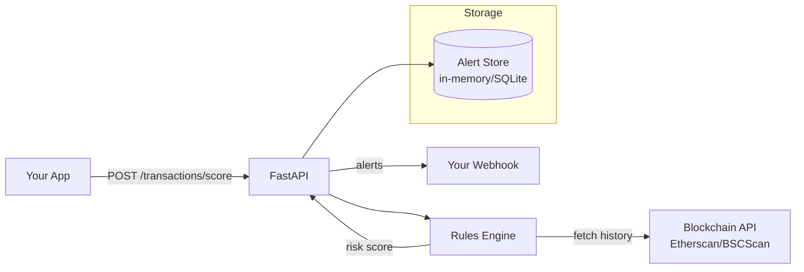

<div align="center">
  
</div>

<div align="center">

[](LICENSE)
[](https://www.python.org/)
[](https://fastapi.tiangolo.com/)
[](https://opensource.org/)
[](CONTRIBUTING.md)
[](https://github.com/Jhingun1/Cryptocomply/commits)
[](https://github.com/Jhingun1/Cryptocomply/stargazers)

</div>

A lightweight, open-source **AML/KYC orchestration API** built with FastAPI,
targeting small crypto and fintech startups (stablecoin apps, DeFi dashboards, payment processors).

---

## 📖 Table of Contents

1. [✨ Features](#-features)
2. [🎯 Who is this for?](#-who-is-this-for)
3. [🧠 Architecture](#-architecture)
4. [🚀 Quick Start](#-quick-start)
5. [📡 API Reference](#-api-reference)
6. [📋 API Examples](#-api-examples)
7. [⚙️ Configuration](#️-configuration)
8. [🔌 Integrations](#-integrations)
9. [🔧 Extending Custom Rules](#-extending-custom-rules)
10. [⛓️ Blockchain Integration](#️-blockchain-integration)
11. [🧪 Testing](#-testing)
12. [🌍 Global Crypto Regulations by Country](#-global-crypto-regulations-by-country)
13. [🗺️ Roadmap](#️-roadmap)
14. [🤝 Contributing](#-contributing)
15. [📄 License](#-license)
16. [💖 Support](#-support)

---

## ✨ Features

<div align="center">
  
</div>
<br/>

- ✅ **JSON-based risk rules** – velocity checks, thresholds, country risk, address blacklists
- ✅ **Modular rules engine** – add custom rules without changing core code
- ✅ **Free blockchain clients** – Etherscan & BSCScan (plug-in architecture for others)
- ✅ **KYC/KYB stub** – drop-in replacement for real providers (Sumsub, Persona)
- ✅ **Webhook alerts** – real-time notifications for flagged transactions
- ✅ **Docker support** – one-command deploy
- ✅ **Open source (MIT)** – auditable, extensible, no vendor lock-in

| Module | Description |
|--------|-------------|
| **Rules Engine** | JSON-configurable risk scoring: velocity checks, amount thresholds, suspicious-address blocklist, country risk |
| **Transaction Monitoring** | `POST /transactions/score` scores any transaction 0–100 and returns triggered alerts |
| **Alerts Feed** | `GET /transactions/alerts` returns recent flagged transactions |
| **KYC/KYB Stub** | In-memory identity verification simulation; swappable for a real provider |
| **Blockchain Client** | Fetches transaction history from Etherscan or BSCScan (free API tier) |

<div align="center">
  
</div>

---

## 🎯 Who is this for?

<div align="center">
  
</div>
<br/>

| User | Why they need CryptoComply |
|------|---------------------------|
| Stablecoin payment startups | USDT/USDC cross-border transfers – affordable monitoring |
| Small remittance corridors | Velocity & country risk checks without a compliance team |
| Local crypto on/off-ramps | AUSTRAC-ready transaction monitoring |
| DeFi front-ends | Block known mixer addresses & high-risk wallets |
| Open-source crypto projects | Show regulators a transparent AML baseline |

---

## 🧠 Architecture

<div align="center">
  
</div>
<br/>

<div align="center">
  
</div>
<br/>

<div align="center">
  
</div>



---

## 🚀 Quick Start

### With Docker (recommended)

```bash
docker run -p 8000:8000 \
  -e ETHERSCAN_API_KEY=your_etherscan_key \
  ghcr.io/jhingun1/cryptocomply:latest
```

### Local installation

```bash
git clone https://github.com/Jhingun1/Cryptocomply.git
cd Cryptocomply
python -m venv venv
source venv/bin/activate   # or `venv\Scripts\activate` on Windows
pip install -r requirements.txt
cp .env.example .env
# Edit .env with your ETHERSCAN_API_KEY
uvicorn main:app --reload
```

The API will be available at **http://localhost:8000**.  
Interactive docs: **http://localhost:8000/docs** (Swagger UI) or **http://localhost:8000/redoc**

---

## 📡 API Reference

<div align="center">
  
</div>
<br/>

### Transaction Monitoring

| Method | Path | Description |
|--------|------|-------------|
| `POST` | `/transactions/score` | Score a transaction (0–100) and list triggered rules |
| `GET` | `/transactions/alerts` | Get recent flagged transactions |
| `DELETE` | `/transactions/alerts` | Clear all alerts (dev/test use) |

### KYC / KYB

| Method | Path | Description |
|--------|------|-------------|
| `GET` | `/kyc/status/{user_id}` | Get verification status for a user |
| `POST` | `/kyc/submit/{user_id}` | Submit identity documents |
| `PATCH` | `/kyc/status/{user_id}` | Manually update status (admin) |
| `GET` | `/kyc/users` | List all KYC records (admin) |

### Blockchain

| Method | Path | Description |
|--------|------|-------------|
| `GET` | `/blockchain/transactions/{address}` | Last N normal transactions (Etherscan) |
| `GET` | `/blockchain/token-transfers/{address}` | Last N ERC-20 token transfers |

### Health

| Method | Path |
|--------|------|
| `GET` | `/` |
| `GET` | `/health` |

<div align="center">
  
</div>

---

## 📋 API Examples

### Score a transaction (curl)

```bash
curl -X POST http://localhost:8000/transactions/score \
  -H "Content-Type: application/json" \
  -d '{
    "from_address": "0x1da5821544e25c636c1417ba96ade4cf6d2f9b5a",
    "to_address": "0xabcdef1234567890abcdef1234567890abcdef12",
    "amount": 75000,
    "currency": "USDC",
    "timestamp": "2024-01-15T12:00:00Z",
    "country_code": "KP"
  }'
```

**Response:**

```json
{
  "transaction_id": "c8f3a1b2-...",
  "risk_score": 100,
  "risk_level": "CRITICAL",
  "flagged": true,
  "triggered_rules": [
    {
      "rule_id": "suspicious_counterparty",
      "rule_name": "Suspicious Counterparty",
      "alert_level": "CRITICAL",
      "risk_score": 80,
      "message": "Address 0x1da58... is on the suspicious counterparty blocklist",
      "details": { "flagged_address": "0x1da5...", "field": "from_address" }
    },
    {
      "rule_id": "single_large_tx",
      "rule_name": "Single Large Transaction",
      "alert_level": "MEDIUM",
      "risk_score": 30,
      "message": "Single transaction amount 75000.0 exceeds threshold of 50000",
      "details": { "amount": 75000.0, "threshold": 50000 }
    }
  ],
  "scored_at": "2024-01-15T12:00:01Z",
  "from_address": "0x1da5821544e25c636c1417ba96ade4cf6d2f9b5a",
  "to_address": "0xabcdef...",
  "amount": 75000.0,
  "currency": "USDC",
  "timestamp": "2024-01-15T12:00:00Z"
}
```

### Score a transaction (Python)

```python
import requests, datetime

resp = requests.post("http://localhost:8000/transactions/score", json={
    "from_address": "0xabc123",
    "to_address": "0xdef456",
    "amount": 500,
    "currency": "ETH",
    "timestamp": datetime.datetime.utcnow().isoformat() + "Z",
})
print(resp.json())
```

### Get flagged transactions

```bash
# All alerts
curl http://localhost:8000/transactions/alerts

# Filter by alert level and sender
curl "http://localhost:8000/transactions/alerts?alert_level=CRITICAL&limit=20"
```

### KYC – submit identity documents

```bash
# Check status (creates PENDING record on first call)
curl http://localhost:8000/kyc/status/user_42

# Submit documents
curl -X POST http://localhost:8000/kyc/submit/user_42 \
  -H "Content-Type: application/json" \
  -d '{"document_type": "passport", "full_name": "Alice Smith", "nationality": "US"}'

# Force review outcome (stub only)
curl -X POST http://localhost:8000/kyc/submit/user_42 \
  -H "Content-Type: application/json" \
  -d '{"document_type": "passport", "review": true}'
```

### Blockchain – fetch transaction history

```bash
# Last 10 ETH transactions
curl "http://localhost:8000/blockchain/transactions/0xde0B295669a9FD93d5F28D9Ec85E40f4cb697BAe?limit=10&chain=ethereum"

# ERC-20 token transfers on BSC
curl "http://localhost:8000/blockchain/token-transfers/0xde0B295669a9FD93d5F28D9Ec85E40f4cb697BAe?chain=bsc"
```

---

## ⚙️ Configuration

Environment variables (`.env` file or system environment):

| Variable | Default | Description |
|----------|---------|-------------|
| `ETHERSCAN_API_KEY` | *(none)* | Required for Ethereum history |
| `BSCSCAN_API_KEY` | *(none)* | Required for BSC history |
| `DEFAULT_CHAIN` | `ethereum` | Default chain for blockchain lookups (`ethereum` \| `bsc`) |
| `HOST` | `0.0.0.0` | Server bind host |
| `PORT` | `8000` | Server bind port |
| `CORS_ORIGINS` | `*` | Comma-separated allowed origins |

`python-dotenv` loads `.env` automatically if present. Copy `.env.example` to `.env` to get started.

---

## 🔌 Integrations

| Service | Status | Notes |
|---------|--------|-------|
| Etherscan | ✅ Supported | Free tier included |
| BSCScan | ✅ Supported | Free tier included |
| Chainalysis | 🚧 Planned | Paid premium connector |
| Elliptic | 🚧 Planned | Paid premium connector |
| Sumsub (KYC) | 🚧 Planned | Drop-in replacement for stub |
| Persona (KYC) | 🚧 Planned | Drop-in replacement for stub |

---

## 🔧 Extending Custom Rules

All rules are defined in `app/rules/rules.json`. No code changes are required to add new rules.

### Rule schema

```json
{
  "id": "my_new_rule",
  "name": "My New Rule",
  "description": "Human-readable description",
  "enabled": true,
  "type": "threshold_single",
  "params": {
    "threshold": 1000
  },
  "risk_score": 25,
  "alert_level": "MEDIUM",
  "message": "Amount {amount} exceeded threshold {threshold}"
}
```

### Supported rule types

| `type` | Description | Key `params` |
|--------|-------------|--------------|
| `velocity` | Max transactions in a time window (per sender) | `max_count`, `window_seconds` |
| `threshold_single` | Single-transaction amount exceeds a value | `threshold` |
| `threshold_cumulative` | Cumulative amount in a time window exceeds a value | `threshold`, `currency`, `window_seconds` |
| `counterparty_blocklist` | Sender or recipient is in `suspicious_addresses.csv` | *(none)* |
| `country_risk` | Sender's country code has a risk level in range [min, max] | `min_risk_level`, `max_risk_level` |

### Adding a new address to the blocklist

Append a row to `app/rules/suspicious_addresses.csv`:

```
0xNEW_ADDRESS_HERE,Label,mixer
```

Call `GET /admin/reload-rules` (or restart the server) to pick up changes.
The engine lazily reloads data on the **first request** after a process start.
To force a hot-reload, call `app.rules.engine.reload_all()`.

### Adding a new country risk entry

Edit `app/rules/country_risk.json`:

```json
"XX": { "name": "Examplestan", "risk_level": 3, "reason": "Sanctions" }
```

### Adding a new rule *type*

1. Add a new case to the `match rule_type:` block in `app/rules/engine.py`.
2. Implement a `_check_<type>()` function following the existing pattern.
3. Add rule entries in `rules.json` with the new type.

---

## ⛓️ Blockchain Integration

The Etherscan client (`app/blockchain/etherscan.py`) exposes two async functions:

```python
from app.blockchain.etherscan import get_transaction_history, get_token_transfers

# Fetch last 10 normal transactions
txs = await get_transaction_history("0xabc...", limit=10, chain="ethereum")

# Fetch last 10 ERC-20 transfers
transfers = await get_token_transfers("0xabc...", limit=10, chain="bsc")
```

Each result dict contains: `hash`, `block_number`, `timestamp`, `from_address`,
`to_address`, `value_eth`, `gas`, `is_error`, `token_symbol`, etc.

To swap in a different provider, replace the implementation in `etherscan.py` while
keeping the same function signatures.

---

## 🧪 Testing

Run unit tests:

```bash
pytest tests/ --cov=app --cov-report=term-missing
```

Or using Docker:

```bash
docker build -t cryptocomply-test .
docker run cryptocomply-test pytest
```

---

---

## 🌍 Global Crypto Regulations by Country

> **Disclaimer:** The information below is for general awareness only and is not legal advice. Regulations change frequently – always consult a qualified legal professional before operating in any jurisdiction.

### 🇺🇸 United States
**Status:** Heavily regulated  
**Key Bodies:** FinCEN, SEC, CFTC, OCC, state regulators  
**Requirements:**
- Crypto exchanges and money transmitters must register with FinCEN as Money Services Businesses (MSBs).
- AML/BSA programs, SAR filing, and CIP (Customer Identification Program) are mandatory.
- The SEC applies the Howey Test to determine if a token is a security; many tokens are classified as securities requiring registration.
- The CFTC regulates crypto derivatives and considers BTC/ETH commodities.
- New York requires a **BitLicense** for entities conducting virtual currency business in the state.
- The Travel Rule (FATF) applies to VASPs above $3,000 thresholds.

---

### 🇬🇧 United Kingdom
**Status:** Regulated – transitioning to comprehensive framework  
**Key Bodies:** Financial Conduct Authority (FCA), HM Treasury  
**Requirements:**
- All crypto asset businesses must register with the FCA under the Money Laundering Regulations 2017.
- AML/CTF policies, customer due diligence (CDD), and enhanced due diligence (EDD) for high-risk customers required.
- The Travel Rule applies above £1,000.
- HM Treasury is implementing a phased regime bringing cryptoassets fully under FSMA 2000.
- Stablecoin issuers will face additional prudential requirements.

---

### 🇪🇺 European Union
**Status:** Comprehensive framework – MiCA in force  
**Key Bodies:** EBA, ESMA, national competent authorities  
**Requirements:**
- **Markets in Crypto-Assets (MiCA)** Regulation fully applicable from December 2024.
- Crypto Asset Service Providers (CASPs) require authorisation in their home member state.
- AML/CTF obligations under the EU AML Package (AMLA) and Transfer of Funds Regulation (TFR).
- Full Travel Rule applies to all crypto transfers regardless of amount.
- Stablecoin issuers (EMTs and ARTs) face strict reserve, redemption, and disclosure requirements.
- White-paper disclosure required for all public token offerings.

---

### 🇩🇪 Germany
**Status:** Regulated – one of Europe's most mature frameworks  
**Key Bodies:** BaFin  
**Requirements:**
- Crypto custody is a licensed financial service under the German Banking Act (KWG).
- BaFin registration mandatory; capital requirements apply.
- Full MiCA compliance required post-2024.
- Tax authority (Bundeszentralamt für Steuern) treats BTC/ETH as private assets; tax-free after 1-year hold.

---

### 🇫🇷 France
**Status:** Regulated – PSAN registration regime  
**Key Bodies:** AMF, ACPR  
**Requirements:**
- Digital Asset Service Providers (DASPs/PSANs) must register with AMF; optional enhanced licence available.
- AML/CTF compliance mandatory; TRACFIN reporting for suspicious activity.
- Full MiCA transition in progress.

---

### 🇨🇭 Switzerland
**Status:** Crypto-friendly – robust regulatory clarity  
**Key Bodies:** FINMA, SRO (VQF, SO-FIT)  
**Requirements:**
- DLT Act provides legal framework for tokenised securities and DLT trading facilities.
- VASPs must join an SRO or obtain a FINMA licence depending on activity.
- Strong AML obligations under AMLA; Travel Rule applies.
- "Crypto Valley" (Zug) provides stable environment; FINMA issues "no-action" and guidance letters proactively.

---

### 🇸🇬 Singapore
**Status:** Regulated – licensing via MAS  
**Key Bodies:** Monetary Authority of Singapore (MAS)  
**Requirements:**
- Digital Payment Token (DPT) service providers require a licence under the Payment Services Act (PSA).
- AML/CTF requirements aligned with FATF; Travel Rule applies above SGD 1,500 (~USD 1,100).
- Major Payment Institution (MPI) or Standard Payment Institution (SPI) licence depending on volume.
- Consumer protection restrictions on retail crypto advertising effective 2022.

---

### 🇯🇵 Japan
**Status:** Regulated – pioneering framework  
**Key Bodies:** Financial Services Agency (FSA)  
**Requirements:**
- Crypto exchanges must register as Crypto Asset Exchange Service Providers (CAESPs) under the Payment Services Act.
- Cold storage requirements, segregated client funds, and annual audits mandatory.
- AML/CTF obligations under the Act on Prevention of Transfer of Criminal Proceeds.
- Stablecoin issuers must be banks, fund transfer operators, or trust companies.
- Travel Rule applies.

---

### 🇰🇷 South Korea
**Status:** Regulated – strict AML focus  
**Key Bodies:** Financial Intelligence Unit (FIU), FSC, FSS  
**Requirements:**
- VASPs must report to FIU and obtain ISMS (Information Security Management System) certification.
- Real-name bank account verification required for all users.
- Anonymous trading banned; foreign exchanges must comply to serve Korean residents.
- Travel Rule applies above KRW 1 million (~USD 750).
- Virtual Asset User Protection Act (2024) adds consumer protection obligations.

---

### 🇦🇺 Australia
**Status:** Regulated – AUSTRAC regime  
**Key Bodies:** AUSTRAC, ASIC, RBA  
**Requirements:**
- DCEs (Digital Currency Exchanges) must register with AUSTRAC.
- AML/CTF Programs Part A and B required; Annual compliance reporting.
- TTRs (Threshold Transaction Reports) for cash transactions ≥ AUD 10,000.
- SMRs (Suspicious Matter Reports) mandatory.
- Travel Rule implementation ongoing under AUSTRAC guidance.
- ASIC regulates crypto products deemed financial products under Corporations Act.

---

### 🇨🇦 Canada
**Status:** Regulated – MSB framework  
**Key Bodies:** FINTRAC, provincial securities regulators (OSC, AMF, etc.)  
**Requirements:**
- Crypto businesses are Money Services Businesses (MSBs) under FINTRAC; registration mandatory.
- AML/CTF compliance, KYC, STR/LCTR reporting required.
- Travel Rule applies above CAD 1,000.
- Provincial securities laws apply to crypto investment products; many exchanges registered as "restricted dealers."

---

### 🇧🇷 Brazil
**Status:** Regulated – new crypto law in force  
**Key Bodies:** Banco Central do Brasil (BCB), CVM, Receita Federal  
**Requirements:**
- Law 14,478/2022 establishes a crypto service provider (VASP) licensing regime under BCB.
- BCB issued Resolution 316/2023 defining rules for VASPs.
- KYC, AML, and suspicious transaction reporting mandatory.
- CVM regulates crypto investment funds and securities tokens.
- Tax reporting required; gains taxed as capital gains.

---

### 🇲🇽 Mexico
**Status:** Regulated – Fintech Law  
**Key Bodies:** Banxico, CNBV  
**Requirements:**
- Ley Fintech (2018) covers crypto-related ITFs (Institución de Tecnología Financiera).
- Banxico authorisation required to operate with virtual assets.
- AML/CTF compliance under LFPIORPI; KYC mandatory.
- Most exchanges must operate under a sandbox or seek formal authorisation.

---

### 🇦🇷 Argentina
**Status:** Evolving – partial regulation  
**Key Bodies:** CNV, BCRA, UIF  
**Requirements:**
- VASPs must register with UIF (Financial Intelligence Unit).
- AML/CTF compliance and STR reporting required.
- BCRA restricts banks from offering crypto custody; crypto peer-to-peer remains largely unregulated.
- High inflation drives significant grass-roots crypto adoption; regulatory clarity improving.

---

### 🇮🇳 India
**Status:** Restrictive but regulated  
**Key Bodies:** RBI, SEBI, FIU-IND, Ministry of Finance  
**Requirements:**
- VDA (Virtual Digital Assets) taxed at flat 30% on gains; 1% TDS on transactions above INR 50,000.
- VASPs must register with FIU-IND; AML/CFT obligations under PMLA (Prevention of Money Laundering Act).
- RBI restricts banks from dealing in crypto but cannot ban exchanges outright per Supreme Court ruling (2020).
- No comprehensive licensing framework yet; sector-specific rules evolving.

---

### 🇨🇳 China
**Status:** Banned – crypto trading and mining prohibited  
**Key Bodies:** PBOC, CSRC, MIIT  
**Requirements:**
- All cryptocurrency trading, exchange services, and ICOs prohibited since September 2021.
- Crypto mining banned in most provinces.
- CBDC (Digital Yuan / e-CNY) is the state-approved digital currency.
- Penalty of criminal prosecution for operating crypto businesses.

---

### 🇭🇰 Hong Kong
**Status:** Regulated – new VASP licensing regime  
**Key Bodies:** SFC (Securities and Futures Commission), HKMA  
**Requirements:**
- VASP licensing mandatory from June 2023 under Anti-Money Laundering and Counter-Terrorist Financing Ordinance.
- Retail trading permitted for licensed exchanges (subject to suitability assessments).
- AML/CTF obligations, Travel Rule compliance required.
- SFC regulates security tokens under existing securities laws.
- HKMA oversees stablecoin issuers under a sandbox and forthcoming licensing regime.

---

### 🇦🇪 United Arab Emirates
**Status:** Crypto-friendly – comprehensive framework  
**Key Bodies:** VARA (Dubai), FSRA (Abu Dhabi ADGM), SCA  
**Requirements:**
- Dubai: Virtual Asset Regulatory Authority (VARA) licensing mandatory for VASPs operating in or from Dubai.
- Abu Dhabi: ADGM's FSRA issues VASP licences; one of the most detailed frameworks in the world.
- AML/CFT compliance, KYC, Travel Rule required.
- VARA published detailed rulebooks covering exchanges, brokers, advisors, and custodians.
- Favourable tax environment (0% capital gains, 0% personal income tax).

---

### 🇸🇦 Saudi Arabia
**Status:** Restrictive – limited regulation  
**Key Bodies:** SAMA, CMA  
**Requirements:**
- SAMA warned against crypto use; no formal licensing framework yet.
- CMA issued warnings; security tokens may be classified as investment products.
- Crypto trading not explicitly legal for retail consumers; institutional pilots ongoing.
- CBDC (Project Aber – bilateral with UAE) under exploration.

---

### 🇮🇱 Israel
**Status:** Evolving – under ISA oversight  
**Key Bodies:** Israel Securities Authority (ISA), Bank of Israel  
**Requirements:**
- ISA applying securities law to tokens on a case-by-case basis.
- AML obligations apply; FIU reporting required.
- New framework in development; currently operating under guidance documents.
- Banks may refuse crypto-related accounts; improving over time.

---

### 🇹🇷 Turkey
**Status:** Regulated – new licensing law (2024)  
**Key Bodies:** Capital Markets Board (SPK), MASAK  
**Requirements:**
- Crypto Asset Service Provider licensing law passed in 2024; SPK as regulator.
- AML/CFT obligations; Travel Rule to be implemented.
- Turkey was on FATF Grey List (removed 2024) – strict AML monitoring ongoing.
- Crypto payments for goods/services banned by CBRT regulation (2021).

---

### 🇷🇺 Russia
**Status:** Restricted – mining legal, payments banned  
**Key Bodies:** Bank of Russia, Rosfinmonitoring  
**Requirements:**
- Federal Law No. 259-FZ (Digital Financial Assets Act) provides limited framework.
- Crypto payments for goods/services prohibited.
- Mining legalised in 2024 with registration requirements.
- AML obligations under Federal Law No. 115-FZ; crypto exchanges must comply.
- International sanctions severely restrict cross-border crypto flows.

---

### 🇿🇦 South Africa
**Status:** Regulated – FSCA licensing  
**Key Bodies:** FSCA, FIC  
**Requirements:**
- Crypto Asset Service Providers (CASPs) declared Financial Service Providers (FSPs) from June 2023; FSCA licences required.
- FIC (Financial Intelligence Centre) AML/CTF obligations apply.
- Travel Rule implementation in progress.
- SARB piloting wholesale CBDC; retail crypto regulated separately.

---

### 🇳🇬 Nigeria
**Status:** Evolving – CBN restrictions partially lifted  
**Key Bodies:** SEC Nigeria, CBN, NFIU  
**Requirements:**
- SEC Nigeria issued rules for digital assets in 2022; VASPs must register.
- CBN lifted its 2021 banking ban on crypto in December 2023; banks may now service VASPs.
- AML/CFT compliance under NFIU guidelines required.
- eNaira (CBDC) promoted as official digital payment alternative.

---

### 🇰🇪 Kenya
**Status:** Developing – limited regulation  
**Key Bodies:** CBK, CMA, NTSA  
**Requirements:**
- CMA issued a regulatory sandbox; some exchanges operate under sandbox licences.
- CBK warned against crypto but has not banned it.
- AML/CTF obligations apply under the Proceeds of Crime and Anti-Money Laundering Act.
- High mobile-money adoption (M-Pesa) shapes fintech regulation landscape.

---

### 🇬🇭 Ghana
**Status:** Early stage – limited regulation  
**Key Bodies:** Bank of Ghana, SEC Ghana  
**Requirements:**
- Bank of Ghana issued caution notices; no formal licensing regime yet.
- AML/CFT obligations apply to financial institutions broadly.
- Digital currency pilots under BoG's sandbox framework.

---

### 🇲🇦 Morocco
**Status:** Restrictive – crypto transactions banned  
**Key Bodies:** Bank Al-Maghrib, AMMC  
**Requirements:**
- Foreign exchange regulations effectively prohibit crypto transactions.
- No formal licensing framework; ban under review.
- Users face penalties for using crypto for payments.

---

### 🇪🇬 Egypt
**Status:** Restrictive – regulated under new law  
**Key Bodies:** CBE, FRA  
**Requirements:**
- Central Bank Law (2020) and Fintech sub-decree (2022) cover digital assets.
- Crypto transactions prohibited without CBE authorisation.
- Islamic finance principles restrict certain token structures.

---

### 🇮🇩 Indonesia
**Status:** Regulated – commodity framework  
**Key Bodies:** OJK (Financial Services Authority), Bappebti (commodity regulator)  
**Requirements:**
- Crypto treated as a commodity (not currency) regulated by Bappebti.
- Exchanges must be registered with Bappebti; national crypto exchange (Bursa Kripto) established.
- AML/CFT obligations; OJK oversees cross-sector risks.
- Crypto payments for goods/services prohibited by Bank Indonesia.

---

### 🇵🇭 Philippines
**Status:** Regulated – BSP licensing  
**Key Bodies:** Bangko Sentral ng Pilipinas (BSP), SEC Philippines  
**Requirements:**
- Virtual Asset Service Providers (VASPs) must obtain a BSP licence.
- AML/CFT compliance under AMLA; reporting to AMLC (Anti-Money Laundering Council) required.
- Travel Rule applies; Circular 1108 governs VASP operations.
- One of Asia's most remittance-driven crypto markets.

---

### 🇹🇭 Thailand
**Status:** Regulated – SEC/BOT oversight  
**Key Bodies:** SEC Thailand, Bank of Thailand  
**Requirements:**
- Digital Asset Business Act (2018) governs exchanges, brokers, and dealers.
- SEC licences required; AML/CTF compliance mandatory.
- Stablecoin and utility token rules issued separately.
- Crypto payments for goods/services effectively restricted by BOT.

---

### 🇻🇳 Vietnam
**Status:** Unregulated – developing framework  
**Key Bodies:** SBV, Ministry of Finance  
**Requirements:**
- No formal legal framework for crypto; SBV has not recognised crypto as legal tender.
- Crypto profits subject to taxation under general income rules.
- New framework expected; sandbox exploration underway.

---

### 🇲🇾 Malaysia
**Status:** Regulated – SC licensing  
**Key Bodies:** Securities Commission Malaysia (SC)  
**Requirements:**
- Digital Asset Exchanges (DAX) and Initial Exchange Offerings (IEOs) require SC recognition.
- AML/CFT obligations under AMLATFPUAA; BNM may apply AML rules to VASPs.
- Travel Rule implementation in progress.

---

### 🇵🇰 Pakistan
**Status:** Evolving – SBP restrictions  
**Key Bodies:** SBP, SECP  
**Requirements:**
- SBP prohibited banks from facilitating crypto transactions (2018); under review.
- SECP exploring regulatory framework for DeFi and digital assets.
- No formal licensing; informal trading prevalent.

---

### 🇧🇩 Bangladesh
**Status:** Banned  
**Key Bodies:** Bangladesh Bank  
**Requirements:**
- Bangladesh Bank issued directives prohibiting crypto transactions.
- No licensing framework; penalties for violations.

---

### 🇱🇰 Sri Lanka
**Status:** Restrictive  
**Key Bodies:** CBSL  
**Requirements:**
- CBSL warned against crypto transactions; no legal framework.
- Foreign exchange controls restrict crypto purchases.

---

### 🇳🇵 Nepal
**Status:** Banned  
**Key Bodies:** Nepal Rastra Bank  
**Requirements:**
- NRB explicitly banned crypto transactions in 2017, reaffirmed since.
- No licensing framework; enforcement actions reported.

---

### 🇰🇿 Kazakhstan
**Status:** Regulated – AIFC framework  
**Key Bodies:** AFSA (Astana International Financial Centre), NBK  
**Requirements:**
- AIFC provides a dedicated regulatory regime for digital assets and exchanges.
- AFSA licences required for VASPs operating in/from AIFC.
- Crypto mining regulated and taxed since 2022 (after major mining influx post-China ban).
- AML/CFT obligations apply.

---

### 🇺🇿 Uzbekistan
**Status:** Regulated – NAPP licensing  
**Key Bodies:** National Agency for Perspective Projects (NAPP)  
**Requirements:**
- Crypto exchanges must obtain NAPP licences.
- AML obligations apply.
- Crypto mining legalised with licensing requirements.
- Uzbekistan positioning itself as a Central Asian crypto hub.

---

### 🇬🇪 Georgia
**Status:** Crypto-friendly – limited regulation  
**Key Bodies:** NBG, GNCC  
**Requirements:**
- No formal licensing framework; crypto exchanges operate with minimal regulation.
- Low energy costs attract crypto mining.
- AML obligations apply broadly under Georgian law.

---

### 🇧🇾 Belarus
**Status:** Legalised – special HTP zone  
**Key Bodies:** HTP (High Technologies Park)  
**Requirements:**
- Crypto activities legal within HTP special economic zone.
- Exchanges, mining, and ICOs permitted; tax exemptions through 2025 extended.
- AML compliance required; international sanctions (EU/US) complicate cross-border operations.

---

### 🇺🇦 Ukraine
**Status:** Regulated – Virtual Assets Law  
**Key Bodies:** NSSMC, NBU  
**Requirements:**
- Law on Virtual Assets (2022) provides legal framework; NSSMC to oversee.
- AML obligations align with FATF standards.
- Crypto accepted for charity donations during conflict; widespread use.
- Full licensing regime implementation pending secondary legislation.

---

### 🇵🇱 Poland
**Status:** Regulated – EU/MiCA framework  
**Key Bodies:** KNF (Polish Financial Supervision Authority)  
**Requirements:**
- VASPs must register with KNF AML registry.
- MiCA applicable as EU member state.
- AML/CTF obligations; Travel Rule applies.

---

### 🇷🇴 Romania
**Status:** Regulated – EU/MiCA framework  
**Key Bodies:** ASF, NBR  
**Requirements:**
- Crypto exchange registration required with AML authority.
- MiCA applicable as EU member state.
- AML/CTF compliance; Travel Rule enforcement in progress.

---

### 🇨🇿 Czech Republic
**Status:** Regulated – EU/MiCA  
**Key Bodies:** CNB (Czech National Bank)  
**Requirements:**
- VASPs register as AML-obliged entities.
- MiCA applicable as EU member state.
- CNB published guidance on crypto classification.

---

### 🇦🇹 Austria
**Status:** Regulated – EU/MiCA  
**Key Bodies:** FMA (Financial Market Authority)  
**Requirements:**
- VASPs must register with FMA; AML compliance required.
- MiCA applicable; some crypto products classified as financial instruments.
- Crypto gains taxed at flat 27.5% rate (since 2022).

---

### 🇳🇱 Netherlands
**Status:** Regulated – EU/MiCA, DNB registration  
**Key Bodies:** De Nederlandsche Bank (DNB), AFM  
**Requirements:**
- VASPs must register with DNB under AMLD5.
- MiCA applicable; AFM regulates investment-type crypto products.
- Travel Rule applies; strict enforcement history.

---

### 🇧🇪 Belgium
**Status:** Regulated – EU/MiCA  
**Key Bodies:** FSMA  
**Requirements:**
- VASPs register with FSMA; AML/CFT compliance required.
- MiCA applicable as EU member state.
- FSMA has publicly warned against several crypto platforms.

---

### 🇪🇸 Spain
**Status:** Regulated – EU/MiCA, CNMV oversight  
**Key Bodies:** CNMV, Banco de España  
**Requirements:**
- VASPs must register with Banco de España for AML purposes.
- CNMV regulates crypto advertising and investment products.
- MiCA applicable; Travel Rule enforced.

---

### 🇮🇹 Italy
**Status:** Regulated – EU/MiCA, OAM registration  
**Key Bodies:** OAM, Banca d'Italia, Consob  
**Requirements:**
- VASPs must register with OAM (Organismo degli Agenti e dei Mediatori).
- MiCA applicable as EU member state.
- AML/CTF obligations; Consob may classify certain tokens as securities.

---

### 🇵🇹 Portugal
**Status:** Regulated – EU/MiCA, Banco de Portugal  
**Key Bodies:** Banco de Portugal, CMVM  
**Requirements:**
- VASPs must register with Banco de Portugal (from 2023).
- MiCA applicable; CMVM regulates investment tokens.
- Previously known for favourable crypto tax treatment (changed in 2023; gains now taxed).

---

### 🇸🇪 Sweden
**Status:** Regulated – EU/MiCA, Finansinspektionen  
**Key Bodies:** Finansinspektionen (FI)  
**Requirements:**
- VASPs must register with FI; AML/CTF compliance mandatory.
- MiCA applicable; FI also regulates crypto ETPs listed on Nasdaq Stockholm.
- Travel Rule enforced.

---

### 🇩🇰 Denmark
**Status:** Regulated – EU/MiCA  
**Key Bodies:** Finanstilsynet  
**Requirements:**
- VASPs must register; AML/CTF obligations apply.
- MiCA applicable as EU member state.

---

### 🇫🇮 Finland
**Status:** Regulated – EU/MiCA  
**Key Bodies:** Fiva (Finnish Financial Supervisory Authority)  
**Requirements:**
- VASPs must register with Fiva.
- MiCA applicable; Travel Rule enforced.

---

### 🇳🇴 Norway
**Status:** Regulated – EEA/MiCA alignment  
**Key Bodies:** Finanstilsynet  
**Requirements:**
- VASPs must register with Finanstilsynet; AML compliance required.
- Norway aligns with MiCA as EEA member.

---

### 🇮🇸 Iceland
**Status:** Regulated – EEA/MiCA alignment  
**Key Bodies:** FME (Financial Supervisory Authority)  
**Requirements:**
- VASPs register with FME; AML/CTF compliance required.
- Former crypto mining hub; high energy costs now reduce activity.

---

### 🇮🇪 Ireland
**Status:** Regulated – EU/MiCA  
**Key Bodies:** Central Bank of Ireland  
**Requirements:**
- VASPs must register with Central Bank for AML purposes.
- MiCA applicable; many global crypto firms use Ireland as EU base.

---

### 🇱🇺 Luxembourg
**Status:** Regulated – EU/MiCA, CSSF  
**Key Bodies:** CSSF  
**Requirements:**
- VASPs register with CSSF; AML/CTF compliance required.
- Payment Institution or E-Money Institution licence may be required depending on activity.
- MiCA applicable; Luxembourg is a major fund-domicile jurisdiction.

---

### 🇲🇹 Malta
**Status:** Regulated – pioneering VFA Act  
**Key Bodies:** MFSA, FIAU  
**Requirements:**
- Virtual Financial Assets (VFA) Act (2018) was one of the world's first crypto-specific laws.
- VFA Agent and MFSA licence required for VASPs.
- MiCA supersedes parts of the VFA Act as EU member state.
- AML/CTF compliance via FIAU.

---

### 🇬🇮 Gibraltar
**Status:** Crypto-friendly – DLT licensing  
**Key Bodies:** GFSC  
**Requirements:**
- DLT Provider framework (2018) pioneered regulated crypto exchanges.
- Exchanges must hold a DLT licence from GFSC.
- AML/CTF compliance; consumer protection obligations.

---

### 🇮🇲 Isle of Man
**Status:** Crypto-friendly – Designated Business registration  
**Key Bodies:** FSA Isle of Man  
**Requirements:**
- Businesses dealing in crypto must register as Designated Businesses under AML/CFT framework.
- No bespoke crypto licence; broader financial services framework applies.

---

### 🇯🇪 Jersey
**Status:** Regulated – JFSC oversight  
**Key Bodies:** Jersey Financial Services Commission (JFSC)  
**Requirements:**
- VASPs register with JFSC; AML/CTF compliance required.
- Virtual Asset Service Provider guidance issued in alignment with FATF standards.

---

### 🇧🇸 Bahamas
**Status:** Regulated – DARE Act  
**Key Bodies:** Securities Commission of the Bahamas (SCB)  
**Requirements:**
- Digital Assets and Registered Exchanges (DARE) Act provides comprehensive licensing.
- Exchanges and digital asset issuers require SCB registration.
- AML/CTF obligations.
- FTX's collapse (formerly based in Bahamas) led to enhanced enforcement.

---

### 🇻🇬 British Virgin Islands
**Status:** Developing – limited regulation  
**Key Bodies:** BVI FSC  
**Requirements:**
- No specific crypto licensing framework yet; securities law may apply to certain tokens.
- AML/CTF obligations apply to entities incorporated in BVI.
- Popular jurisdiction for crypto fund structures.

---

### 🇰🇾 Cayman Islands
**Status:** Developing – Virtual Asset legislation  
**Key Bodies:** CIMA  
**Requirements:**
- Virtual Asset (Service Providers) Act (VASPA) provides registration framework.
- AML/CTF compliance required; CIMA enforcement increasing.
- Popular offshore jurisdiction for DeFi and crypto fund structures.

---

### 🇧🇲 Bermuda
**Status:** Regulated – DABA framework  
**Key Bodies:** BMA (Bermuda Monetary Authority)  
**Requirements:**
- Digital Asset Business Act (DABA) requires BMA licences for digital asset businesses.
- Class F (full) or Class M (provisional) licences; AML/CTF compliance mandatory.
- Bermuda TCSP requirements may apply for token issuance.

---

### 🇱🇮 Liechtenstein
**Status:** Regulated – pioneering TVTG  
**Key Bodies:** FMA Liechtenstein  
**Requirements:**
- Token and Trusted Technology Service Provider Act (TVTG, 2020) is one of the world's most comprehensive token laws.
- Broad set of token service providers require FMA registration.
- AML/CTF obligations; Travel Rule applies.
- EEA membership means MiCA alignment.

---

### 🇲🇨 Monaco
**Status:** Developing  
**Key Bodies:** CCAF, Government of Monaco  
**Requirements:**
- Crypto activities subject to general AML laws.
- No specific licensing regime; draft legislation under development.

---

### 🇸🇲 San Marino
**Status:** Developing – Digital Innovation legislation  
**Key Bodies:** BCSM (Central Bank of San Marino)  
**Requirements:**
- Law on Innovative Technology Enterprises (2019) provides sandbox environment.
- Crypto companies may obtain "Innovative Company" status.
- AML/CTF obligations apply.

---

### 🇵🇦 Panama
**Status:** Developing – crypto bill in progress  
**Key Bodies:** MEF, SBN  
**Requirements:**
- Crypto bill (Law 129/2022) passed by Assembly but vetoed; revised version under consideration.
- AML/CTF obligations apply to financial entities broadly.

---

### 🇸🇻 El Salvador
**Status:** Bitcoin Legal Tender  
**Key Bodies:** National Bitcoin Office (ONBTC), BCR  
**Requirements:**
- Bitcoin Legal Tender Act (2021) made BTC legal tender; mandatory acceptance for goods/services (though compliance patchy).
- IMF deal (2025) softened mandatory acceptance requirements.
- ONBTC oversees digital asset policy.
- AML obligations apply; Travel Rule being implemented.
- Chivo wallet provides national BTC infrastructure.

---

### 🇧🇿 Belize
**Status:** Limited regulation  
**Key Bodies:** Central Bank of Belize  
**Requirements:**
- No formal crypto licensing regime; general AML law applies.
- CBB has issued consumer warnings.

---

### 🇬🇹 Guatemala
**Status:** Unregulated  
**Key Bodies:** Banguat, SIB  
**Requirements:**
- No specific crypto regulation; general financial supervision applies.
- AML obligations under LAVFD.

---

### 🇧🇴 Bolivia
**Status:** Banned  
**Key Bodies:** BCB  
**Requirements:**
- Bolivia banned crypto transactions in 2020 citing foreign currency laws; ban reaffirmed.
- No licensing framework.

---

### 🇵🇾 Paraguay
**Status:** Developing – crypto mining bill  
**Key Bodies:** BCP, ANDE  
**Requirements:**
- Crypto mining regulation passed (2022) with licensing and taxation requirements.
- No comprehensive VASP licensing yet.
- Low electricity costs attract significant crypto mining operations.

---

### 🇺🇾 Uruguay
**Status:** Developing  
**Key Bodies:** BCU, URSEA  
**Requirements:**
- No specific licensing framework; BCU has issued guidance.
- AML obligations broadly applicable.

---

### 🇨🇱 Chile
**Status:** Developing  
**Key Bodies:** CMF, SBIF  
**Requirements:**
- No formal crypto licensing; CMF studying regulatory options.
- AML obligations apply; banks may deny services to crypto businesses.

---

### 🇵🇪 Peru
**Status:** Developing  
**Key Bodies:** SBS, SMV  
**Requirements:**
- No formal crypto regulation; SBS has issued warnings.
- Tax authority (SUNAT) treats crypto as assets subject to capital gains tax.

---

### 🇨🇴 Colombia
**Status:** Developing – sandbox  
**Key Bodies:** SFC (Superintendencia Financiera de Colombia)  
**Requirements:**
- SFC ran a crypto exchange sandbox (2020–2022); expanding framework.
- AML/CFT obligations apply; UIAF reporting for suspicious activity.

---

### 🇻🇪 Venezuela
**Status:** Regulated – SUNACRIP  
**Key Bodies:** SUNACRIP  
**Requirements:**
- SUNACRIP (Superintendencia Nacional de Criptoactivos) licenses and regulates exchanges.
- Petro (state crypto) attempted but largely failed; Bitcoin widely used due to hyperinflation.
- AML obligations apply.

---

### 🇪🇨 Ecuador
**Status:** Restricted  
**Key Bodies:** BCE, SB  
**Requirements:**
- Electronic money regulations restrict private digital currencies.
- Crypto trading not explicitly banned but heavily restricted.

---

### 🇯🇲 Jamaica
**Status:** Developing  
**Key Bodies:** BOJ, FSC Jamaica  
**Requirements:**
- No formal crypto licensing; BOJ issued consumer cautions.
- JAM-DEX (CBDC) launched 2022 as official digital currency alternative.

---

### 🇹🇹 Trinidad and Tobago
**Status:** Developing  
**Key Bodies:** CBTT, TTSEC  
**Requirements:**
- No formal crypto regulation; TTSEC studying framework.
- AML obligations broadly apply.

---

### 🇧🇧 Barbados
**Status:** Developing  
**Key Bodies:** Central Bank of Barbados  
**Requirements:**
- No specific crypto licensing; sandbox discussions ongoing.
- CBDC pilot (DCash – Eastern Caribbean) indirectly relevant.

---

### 🇮🇸🇰🇳 Eastern Caribbean (ECCU Members)
> Includes 🇦🇬 Antigua & Barbuda, 🇩🇲 Dominica, 🇬🇩 Grenada, 🇰🇳 St Kitts & Nevis, 🇱🇨 St Lucia, 🇻🇨 St Vincent

**Status:** CBDC-forward – DCash  
**Key Bodies:** Eastern Caribbean Central Bank (ECCB)  
**Requirements:**
- DCash CBDC launched 2021 across ECCU.
- No unified VASP licensing; individual member states apply AML obligations.

---

### 🇿🇼 Zimbabwe
**Status:** Developing – ZiG digital currency  
**Key Bodies:** RBZ  
**Requirements:**
- RBZ issued crypto regulations in 2023; VASPs must register.
- New ZiG (Zimbabwe Gold) structured digital currency introduced 2024.
- AML/CTF obligations apply.

---

### 🇧🇼 Botswana
**Status:** Developing  
**Key Bodies:** NBFIRA, Bank of Botswana  
**Requirements:**
- No formal crypto licensing; AML Act broadly applies.
- NBFIRA exploring regulatory framework.

---

### 🇷🇼 Rwanda
**Status:** Developing – sandbox  
**Key Bodies:** BNR, Rwanda Fintech Association  
**Requirements:**
- BNR regulatory sandbox open to fintech and crypto players.
- No formal VASP licensing yet; AML obligations apply.

---

### 🇪🇹 Ethiopia
**Status:** Restrictive  
**Key Bodies:** NBE  
**Requirements:**
- NBE prohibited crypto transactions; no licensing framework.
- Broad-based financial inclusion strategy focuses on mobile money (Telebirr).

---

### 🇹🇿 Tanzania
**Status:** Developing  
**Key Bodies:** BOT, TCRA  
**Requirements:**
- BOT issued consultation paper (2022); no final framework yet.
- Mobile money regulation (M-Pesa dominant) shapes fintech environment.

---

### 🇺🇬 Uganda
**Status:** Developing  
**Key Bodies:** BOU  
**Requirements:**
- BOU issued warnings; no formal crypto regulation.
- AML obligations broadly apply.

---

### 🇸🇳 Senegal
**Status:** WAEMU Framework  
**Key Bodies:** BCEAO (West African Central Bank)  
**Requirements:**
- BCEAO issued a framework for digital assets across WAEMU region.
- E-money and mobile money dominant; crypto regulation developing.

---

### 🇨🇮 Côte d'Ivoire
**Status:** WAEMU Framework  
**Key Bodies:** BCEAO  
**Requirements:**
- Same as Senegal; BCEAO framework applies to WAEMU member states.

---

### 🇲🇺 Mauritius
**Status:** Regulated – FSC licensing  
**Key Bodies:** Financial Services Commission (FSC Mauritius)  
**Requirements:**
- Digital Asset framework under FSC; VASPs require licence.
- AML/CFT obligations aligned with FATF standards.
- Mauritius removed from FATF Grey List (2022); compliance improving.

---

### 🇸🇨 Seychelles
**Status:** Developing  
**Key Bodies:** FSA Seychelles  
**Requirements:**
- FSA issued virtual asset service provider guidelines.
- AML obligations apply; known for offshore crypto business registrations.

---

### 🇲🇻 Maldives
**Status:** Developing  
**Key Bodies:** MMA  
**Requirements:**
- No formal crypto regulation; MMA studying framework.
- Tourism-driven economy exploring CBDC options.

---

### 🇧🇭 Bahrain
**Status:** Regulated – CBB licensing  
**Key Bodies:** Central Bank of Bahrain (CBB)  
**Requirements:**
- CBB Crypto-Asset Module (Volume 6) provides licensing framework for exchanges and custodians.
- AML/CTF compliance; Travel Rule expected.
- Bahrain positioned as Gulf crypto-friendly hub alongside UAE.

---

### 🇶🇦 Qatar
**Status:** Restrictive  
**Key Bodies:** QCB, QFMA  
**Requirements:**
- QCB prohibits most crypto activities for retail consumers.
- Qatar Financial Centre (QFC) studying separate framework for institutional players.
- No retail VASP licensing.

---

### 🇰🇼 Kuwait
**Status:** Banned  
**Key Bodies:** CBK, CMA  
**Requirements:**
- CBK and CMA prohibited trading, investing, and transacting in cryptocurrencies.
- No licensing framework.

---

### 🇴🇲 Oman
**Status:** Developing  
**Key Bodies:** CBO, CMA Oman  
**Requirements:**
- No formal crypto licensing; CBO issued warnings.
- CMA Oman exploring regulatory sandbox for digital assets.

---

### 🇯🇴 Jordan
**Status:** Restrictive  
**Key Bodies:** CBJ  
**Requirements:**
- CBJ warned against crypto use; no formal framework.
- Some licensed payment services may interact with digital assets.

---

### 🇱🇧 Lebanon
**Status:** Unregulated – de facto usage widespread  
**Key Bodies:** BDL  
**Requirements:**
- BDL has not provided a regulatory framework; significant informal crypto usage due to banking crisis.
- AML obligations difficult to enforce amid financial system instability.

---

### 🇮🇶 Iraq
**Status:** Banned  
**Key Bodies:** CBI  
**Requirements:**
- CBI explicitly prohibited crypto transactions.
- No licensing framework.

---

### 🇮🇷 Iran
**Status:** Regulated – state mining only  
**Key Bodies:** CBI, Ministry of Industries  
**Requirements:**
- Crypto mining legalised for licensed miners (since 2019) as a way to monetise subsidised energy.
- Crypto trading for payments banned by CBI; used informally to circumvent sanctions.
- Licensed miners must sell mined crypto to CBI.

---

### 🇦🇫 Afghanistan
**Status:** Banned (under Taliban rule)  
**Requirements:**
- Taliban authorities banned crypto in 2022.
- No licensing framework.

---

### 🇵🇰 Pakistan *(see above)*

---

### 🇲🇲 Myanmar
**Status:** Banned (by military government)  
**Requirements:**
- Military junta banned crypto in 2022; NUG (shadow government) accepts BTC donations.

---

### 🇰🇭 Cambodia
**Status:** Banned – CBDC focus  
**Key Bodies:** NBC  
**Requirements:**
- NBC banned crypto trading; Bakong (CBDC) promoted as digital payment solution.
- No VASP licensing for private crypto.

---

### 🇱🇦 Laos
**Status:** Pilot – limited legalisation  
**Key Bodies:** BOL  
**Requirements:**
- Pilot programme (2021) allowed limited crypto trading and mining.
- AML obligations apply; framework remains nascent.

---

### 🇲🇴 Macao
**Status:** Restrictive  
**Key Bodies:** AMCM  
**Requirements:**
- AMCM prohibits crypto for payment purposes; gaming regulator restricts crypto in casinos.
- No licensing framework.

---

### 🇹🇼 Taiwan
**Status:** Regulated – FSC oversight  
**Key Bodies:** FSC Taiwan  
**Requirements:**
- VASPs must register with FSC; AML/CTF compliance (since 2021).
- Travel Rule implementation ongoing.
- FSC developing comprehensive VASP licensing framework.

---

### 🇲🇳 Mongolia
**Status:** Developing  
**Key Bodies:** FRC, Bank of Mongolia  
**Requirements:**
- No formal crypto regulation; FRC exploring framework.
- Energy resources attract crypto mining interest.

---

### 🇰🇬 Kyrgyzstan
**Status:** Developing  
**Key Bodies:** NBKR  
**Requirements:**
- No formal VASP licensing; AML obligations broadly apply.
- Mining gaining traction due to low energy costs.

---

### 🇹🇯 Tajikistan
**Status:** Restrictive  
**Key Bodies:** NBT  
**Requirements:**
- NBT restricted crypto transactions; no formal framework.

---

### 🇹🇲 Turkmenistan
**Status:** Unregulated  
**Key Bodies:** CBT  
**Requirements:**
- No regulation; very limited internet access and closed economy restrict adoption.

---

### 🇦🇿 Azerbaijan
**Status:** Developing  
**Key Bodies:** CBA (Central Bank of Azerbaijan)  
**Requirements:**
- CBA studying regulatory framework; no formal VASP licensing.
- AML obligations broadly apply.

---

### 🇦🇲 Armenia
**Status:** Developing  
**Key Bodies:** CBA Armenia  
**Requirements:**
- No formal crypto licensing; CBA studying framework.
- Crypto-friendly environment de facto; exchange hubs emerging.

---

### 🇲🇩 Moldova
**Status:** Developing – EU alignment  
**Key Bodies:** NBM, NCFM  
**Requirements:**
- No formal VASP licensing; EU association agreement guides MiCA-aligned development.
- AML obligations apply.

---

### 🇦🇱 Albania
**Status:** Regulated – EU candidate  
**Key Bodies:** AMF Albania  
**Requirements:**
- Law on Financial Markets based on Crypto-Assets (2020) provides framework.
- AMF licences required; AML/CTF obligations.
- EU candidate status driving MiCA alignment.

---

### 🇷🇸 Serbia
**Status:** Regulated – Digital Assets Act  
**Key Bodies:** SEC Serbia, NBS  
**Requirements:**
- Digital Assets Act (2021) provides VASP licensing via SEC Serbia.
- AML/CTF compliance required; Travel Rule to be implemented.

---

### 🇭🇷 Croatia
**Status:** Regulated – EU/MiCA  
**Key Bodies:** HANFA  
**Requirements:**
- VASPs register with HANFA; MiCA applicable as EU member state.
- AML/CTF obligations.

---

### 🇸🇮 Slovenia
**Status:** Regulated – EU/MiCA  
**Key Bodies:** ATVP  
**Requirements:**
- VASPs registered with ATVP; MiCA applicable.
- Notable for high crypto per-capita adoption.

---

### 🇧🇦 Bosnia and Herzegovina
**Status:** Developing  
**Key Bodies:** BHAS, CBBH  
**Requirements:**
- No unified crypto framework (entity-level complexity); AML obligations apply.

---

### 🇲🇰 North Macedonia
**Status:** Restrictive – ban under review  
**Key Bodies:** NBRM  
**Requirements:**
- NBRM banned crypto use; under review as EU candidate country.

---

### 🇽🇰 Kosovo
**Status:** Banned  
**Key Bodies:** CBK  
**Requirements:**
- CBK prohibited crypto activities; significant informal usage due to energy subsidies and diaspora remittances.

---

### 🇧🇬 Bulgaria
**Status:** Regulated – EU/MiCA  
**Key Bodies:** FSC Bulgaria, BNB  
**Requirements:**
- VASPs register with FSC; MiCA applicable as EU member state.
- AML/CTF obligations; Travel Rule enforced.

---

### 🇭🇺 Hungary
**Status:** Regulated – EU/MiCA  
**Key Bodies:** MNB (Magyar Nemzeti Bank)  
**Requirements:**
- VASPs must register with MNB; MiCA applicable.
- AML/CTF compliance; crypto gains taxed at 15%.

---

### 🇸🇰 Slovakia
**Status:** Regulated – EU/MiCA  
**Key Bodies:** NBS  
**Requirements:**
- VASPs register; MiCA applicable as EU member state.
- AML/CTF obligations.

---

### 🇱🇻 Latvia
**Status:** Regulated – EU/MiCA  
**Key Bodies:** FKTK  
**Requirements:**
- VASPs register with FKTK; MiCA applicable.
- Travel Rule enforced; AML/CTF compliance.

---

### 🇱🇹 Lithuania
**Status:** Regulated – EU/MiCA  
**Key Bodies:** Bank of Lithuania  
**Requirements:**
- Major EU crypto licence hub due to streamlined VASP registration.
- Hundreds of crypto companies registered; MiCA now supersedes.
- AML/CTF compliance; Travel Rule.

---

### 🇪🇪 Estonia
**Status:** Regulated – EU/MiCA  
**Key Bodies:** FIU Estonia, Finantsinspektsioon  
**Requirements:**
- Previously one of the easiest EU VASP jurisdictions; stringent review since 2020 led to mass revocations.
- MiCA applicable; strict AML/CTF enforcement.
- Travel Rule enforced.

---

### 🇫🇴 Faroe Islands / 🇬🇱 Greenland
**Status:** Danish autonomous territories – limited framework  
**Requirements:**
- Financial regulation largely follows Danish/EU rules; specific crypto guidance limited.

---

## 🗺️ Roadmap

- [x] Basic rules engine (velocity, threshold, country, blacklist)
- [x] Etherscan integration
- [x] BSCScan integration
- [x] Docker support
- [x] Webhook alerts
- [ ] Persistent storage (SQLite, PostgreSQL)
- [ ] Real-time WebSocket streaming for alerts
- [ ] Pre-built sanction lists (OFAC, UN, AUSTRAC)
- [ ] Admin dashboard (React + FastAPI)
- [ ] Terraform module for AWS/GCP deployment
- [ ] Premium rule packs (machine-learning based)

---

## 🤝 Contributing

Contributions of all kinds are welcome – bug reports, feature requests, documentation improvements, and code.

1. Fork the repo
2. Create a feature branch (`git checkout -b feature/amazing`)
3. Commit changes (`git commit -m 'Add amazing feature'`)
4. Push to the branch (`git push origin feature/amazing`)
5. Open a Pull Request

Run tests locally before submitting:

```bash
pytest tests/
```

---

## 📄 License

CryptoComply is open source under the **MIT License** – see [LICENSE](LICENSE) for details.

---

## 💖 Support

If CryptoComply saves you compliance costs or helps you sleep better at night, consider:

- ⭐ **Starring this repo** – it helps others discover it
- 🐛 **Opening issues** – bug reports and feature ideas are always welcome
- 🤝 **Contributing** – see the section above

---

Built with ❤️ for compliant crypto startups everywhere.
